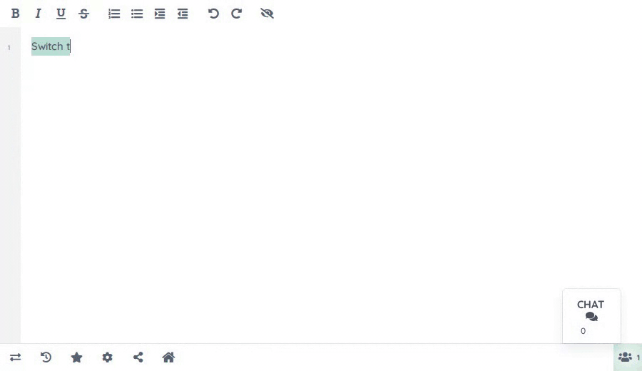

 [](https://github.com/ether/ep_themes/actions/workflows/test-and-release.yml)

# Change the styling of a pad by clicking in Settings and selecting a style

# Available Themes:

* normal
* terminal
* hacker
* cybergal
* monokai
* ... Please add more! :)

## Available URL Params
```
theme     = Name of the theme IE hacker or terminal IE ?theme=hacker
```

# Usage
To use add the params to your Pad URL IE

``?theme=terminal``


# CONTRIBUTING
To add more themes send a pull request with your deisgns.  Examples for how to do this are in themes.js and it should be easy to test with
```
themes.setTheme('#000', '#07C201', '#07C201', '#07C201', '#07C201', '#000', '#000');
// replace with your colors :)
```

# INSTALL
Install via the /admin/plugins UI in Etherpad.

Requires Etherpad >= version 1.7.6
The following can optionally be added to your settings.json:  

    "ep_themes":{  
      "default_theme": "hacker"  
    }

## Installation

Install from the Etherpad admin UI (**Admin → Manage Plugins**,
search for `ep_themes` and click *Install*), or from the Etherpad
root directory:

```sh
pnpm run plugins install ep_themes
```

> ⚠️ Don't run `npm i` / `npm install` yourself from the Etherpad
> source tree — Etherpad tracks installed plugins through its own
> plugin-manager, and hand-editing `package.json` can leave the
> server unable to start.

After installing, restart Etherpad.
